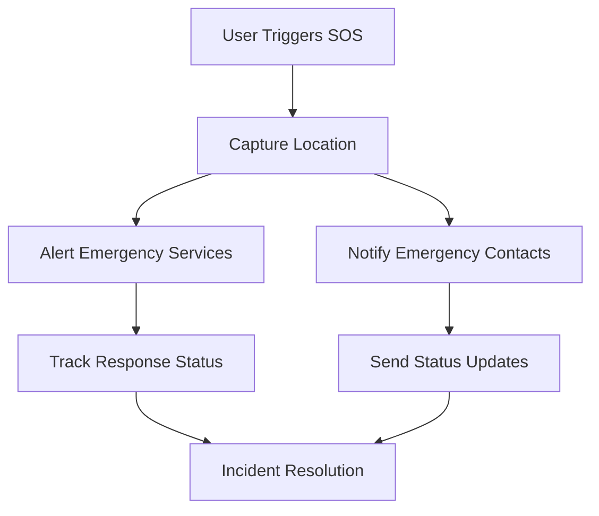

# CitizenShield Mobile Project Structure

This document provides a detailed overview of the CitizenShield Mobile application's project structure, organization, and functionality.

## Table of Contents
1. [Directory Structure](#directory-structure)
2. [Application Architecture](#application-architecture)
3. [Core Features](#core-features)
4. [User Workflows](#user-workflows)
5. [Technical Implementation](#technical-implementation)
6. [Security Measures](#security-measures)
7. [Performance Optimization](#performance-optimization)
8. [Testing Strategy](#testing-strategy)

## Directory Structure

```
frontend/
├── app/                        # Application screens and navigation
│   ├── (main)/                # Main authenticated screens
│   │   ├── home.tsx           # Home screen with emergency features
│   │   ├── forum.tsx          # Community forum screen
│   │   ├── blog.tsx           # News and updates screen
│   │   └── _layout.tsx        # Layout for main screens
│   ├── post/                  # Post-related screens
│   │   └── [id].tsx          # Individual post view
│   ├── message/               # Messaging screens
│   │   └── [id].tsx          # Individual message thread
│   ├── index.tsx             # Entry point/Landing page
│   ├── login.tsx             # Login screen
│   ├── signup.tsx            # Registration screen
│   ├── profile.tsx           # User profile screen
│   ├── edit-profile.tsx      # Profile editing screen
│   ├── notifications.tsx     # Notifications center
│   ├── police-database.tsx   # Law enforcement database interface
│   ├── contact-support.tsx   # Support contact screen
│   ├── privacy-policy.tsx    # Privacy policy page
│   ├── reset-password.tsx    # Password reset screen
│   ├── change-password.tsx   # Password change screen
│   └── +not-found.tsx        # 404 error page
│
├── assets/                    # Static assets
│   ├── images/               # Image assets
│   └── fonts/                # Custom fonts
│
├── components/               # Reusable UI components
│   ├── auth/                # Authentication-related components
│   ├── common/              # Shared UI components
│   ├── emergency/           # Emergency-related components
│   ├── forms/               # Form components
│   ├── layout/             # Layout components
│   └── maps/               # Map-related components
│
├── config/                  # Configuration files
│   ├── firebase.ts         # Firebase configuration
│   └── constants.ts        # App-wide constants
│
├── constants/              # Application constants
│   ├── theme.ts           # Theme constants
│   ├── colors.ts          # Color definitions
│   ├── layout.ts          # Layout constants
│   └── api.ts            # API endpoints
│
├── context/               # React Context providers
│   ├── AuthContext.tsx    # Authentication context
│   └── ThemeContext.tsx   # Theme context
│
├── hooks/                 # Custom React hooks
│   ├── useAuth.ts        # Authentication hook
│   ├── useLocation.ts    # Location services hook
│   ├── useNotifications.ts # Notifications hook
│   └── useTheme.ts       # Theme hook
│
├── types/                 # TypeScript type definitions
│   ├── index.ts          # Common types
│   └── routes.ts         # Navigation route types
│
├── utils/                # Utility functions
│   ├── api.ts           # API utilities
│   └── helpers.ts       # Helper functions
│
└── __tests__/           # Test files
    └── App.test.tsx     # App component tests
```

## Application Architecture

### System Overview
CitizenShield Mobile is built on a modern, scalable architecture that prioritizes:
- Real-time emergency response
- Secure user data handling
- Offline functionality
- Cross-platform compatibility
- Scalable infrastructure

### Technology Stack
- **Frontend**: React Native with Expo
- **State Management**: React Context + Hooks
- **Authentication**: Firebase Auth
- **Database**: Firebase Realtime Database
- **Storage**: Firebase Cloud Storage
- **Push Notifications**: Expo Notifications
- **Maps**: React Native Maps
- **Location Services**: Expo Location
- **API Integration**: RESTful APIs + WebSocket

## Core Features

### 1. Emergency Response System
#### SOS Alert System
- **Activation Methods**:
  - Panic button
  - Voice command
  - Shake gesture
  - Widget trigger
- **Alert Types**:
  - Medical emergency
  - Security threat
  - Fire emergency
  - Natural disaster
- **Response Flow**:
  1. Alert triggered by user
  2. Location data captured
  3. Nearest emergency services notified
  4. Emergency contacts alerted
  5. Real-time status updates provided

#### Location Tracking
- Real-time GPS tracking
- Geofencing alerts
- Location history
- Safe route suggestions
- Offline location caching

### 2. User Authentication & Security
#### Authentication Methods
- Email/Password
- Phone number verification
- Social media login
- Biometric authentication
- Two-factor authentication

#### Security Features
- End-to-end encryption
- Secure data storage
- Session management
- Activity logging
- Device verification

### 3. Community Safety Network
#### Forum System
- Community discussions
- Safety tips sharing
- Event organization
- Emergency updates
- Resource sharing

#### Neighborhood Watch
- Incident reporting
- Suspicious activity alerts
- Community patrols
- Safety statistics
- Area risk assessment

### 4. Emergency Services Integration
#### Police Database
- Criminal records access
- Missing persons database
- Wanted persons alerts
- Vehicle registration check
- Incident reports

#### Emergency Services
- Direct emergency calling
- Hospital locations
- Fire station mapping
- Police station locator
- Emergency routes

## User Workflows

### 1. Emergency Response Workflow


### 2. User Registration Flow
1. **Initial Sign-up**
   - Email verification
   - Phone verification
   - Profile creation
   - Emergency contacts setup
   - Preferences configuration

2. **Profile Setup**
   - Personal information
   - Medical information
   - Emergency contacts
   - Notification preferences
   - Privacy settings

3. **Verification Process**
   - Identity verification
   - Document upload
   - Address verification
   - Contact verification
   - Background check

### 3. Incident Reporting Flow
1. **Incident Creation**
   - Category selection
   - Location marking
   - Description entry
   - Media upload
   - Witness information

2. **Report Processing**
   - Automatic categorization
   - Priority assessment
   - Authority notification
   - Community alert
   - Status tracking

## Technical Implementation

### 1. State Management
```typescript
// Example AuthContext implementation
interface AuthState {
  user: User | null;
  isAuthenticated: boolean;
  loading: boolean;
}

const AuthContext = createContext<AuthState>({
  user: null,
  isAuthenticated: false,
  loading: true
});
```

### 2. API Integration
```typescript
// Example API service
class EmergencyService {
  async triggerSOS(location: Location, type: EmergencyType): Promise<Response> {
    try {
      const response = await api.post('/emergency/sos', {
        location,
        type,
        timestamp: new Date()
      });
      return response;
    } catch (error) {
      handleError(error);
    }
  }
}
```

### 3. Real-time Updates
```typescript
// Example WebSocket implementation
class EmergencySocket {
  private socket: WebSocket;

  constructor() {
    this.socket = new WebSocket(EMERGENCY_SOCKET_URL);
    this.setupListeners();
  }

  private setupListeners(): void {
    this.socket.onmessage = (event) => {
      const data = JSON.parse(event.data);
      handleEmergencyUpdate(data);
    };
  }
}
```

## Security Measures

### 1. Data Encryption
- End-to-end encryption for messages
- AES-256 encryption for stored data
- SSL/TLS for data in transit
- Encrypted local storage
- Secure key management

### 2. Authentication Security
- JWT token management
- Session timeout handling
- Biometric authentication
- Device fingerprinting
- Brute force protection

### 3. Privacy Controls
- Data anonymization
- User consent management
- Data retention policies
- Access control lists
- Privacy audit logs

## Performance Optimization

### 1. Code Optimization
- Code splitting
- Lazy loading
- Memory management
- Cache optimization
- Bundle size reduction

### 2. Network Optimization
- API request batching
- Response caching
- Offline support
- Data compression
- Connection resilience

### 3. Resource Management
- Image optimization
- Background process handling
- Battery usage optimization
- Storage management
- Memory leak prevention

## Testing Strategy

### 1. Unit Testing
```typescript
// Example test suite
describe('EmergencyService', () => {
  it('should trigger SOS alert', async () => {
    const service = new EmergencyService();
    const response = await service.triggerSOS(mockLocation, EmergencyType.MEDICAL);
    expect(response.status).toBe(200);
  });
});
```

### 2. Integration Testing
- API integration tests
- Component integration
- Service integration
- Database integration
- Third-party service integration

### 3. End-to-End Testing
- User flow testing
- Cross-platform testing
- Network condition testing
- Device compatibility
- Performance testing

## Deployment Process

### 1. CI/CD Pipeline
```yaml
# Example GitHub Actions workflow
name: Deploy
on:
  push:
    branches: [main]
jobs:
  deploy:
    runs-on: ubuntu-latest
    steps:
      - uses: actions/checkout@v2
      - name: Install Dependencies
        run: npm install
      - name: Run Tests
        run: npm test
      - name: Build
        run: npm run build
```

### 2. Release Management
- Version control
- Change documentation
- Feature flagging
- Rollback procedures
- Beta testing

## Monitoring and Analytics

### 1. Performance Monitoring
- Error tracking
- Performance metrics
- User analytics
- Crash reporting
- Usage statistics

### 2. Security Monitoring
- Security alerts
- Access logs
- Threat detection
- Vulnerability scanning
- Compliance monitoring

_Last updated: January 15, 2025_
